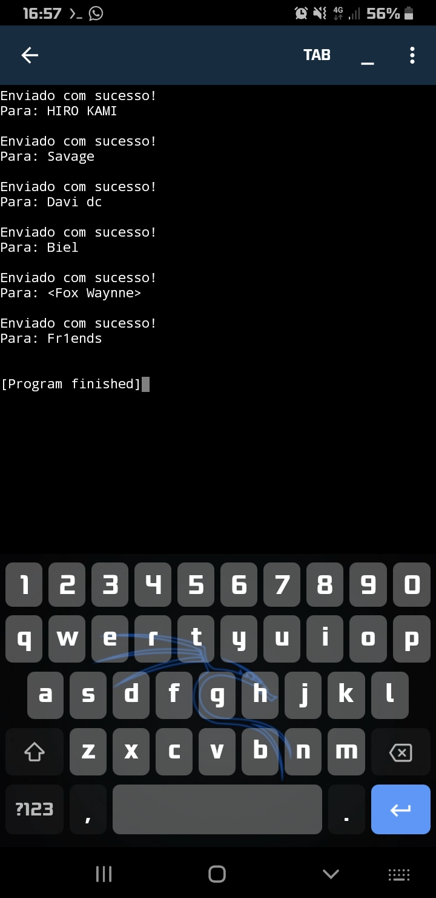

# EmailBot
> Bot envio de emails em python, normalmente ultilizado em empresas, sites e apps para o envio em massa de e-mails. registrados.

## Requisitos
1. Criei ultilizando o app PyDroid3 no mobile.
1. Versão Atual
     - Python 3.9.7
1. Moldolos usados no projeto
     - smtplib
          - pandas
               - time
## Modo de uso
Para definir para que email vai ser enviado modifique o arquivo `/root_bot/users.xlsx`

Após isso escreva sua menssagem no arquivo `/root_bot/menssagem.html` e execute o `main.py` para fazer os envios
### ScreenShot

